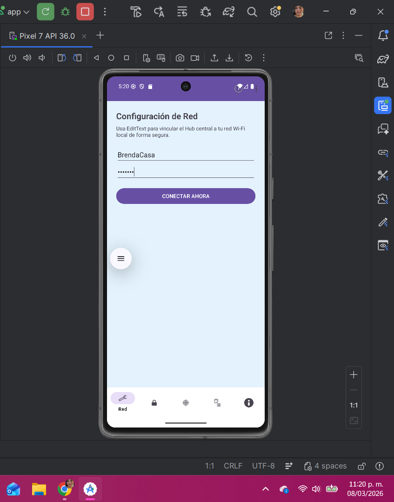
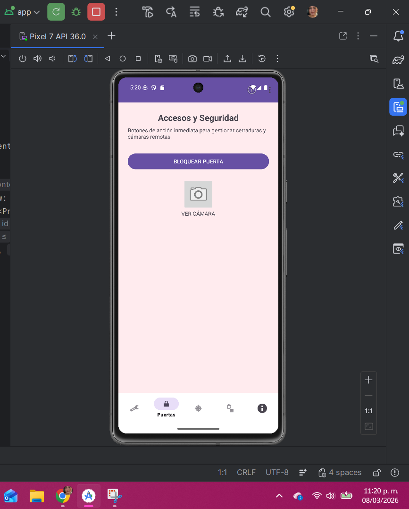
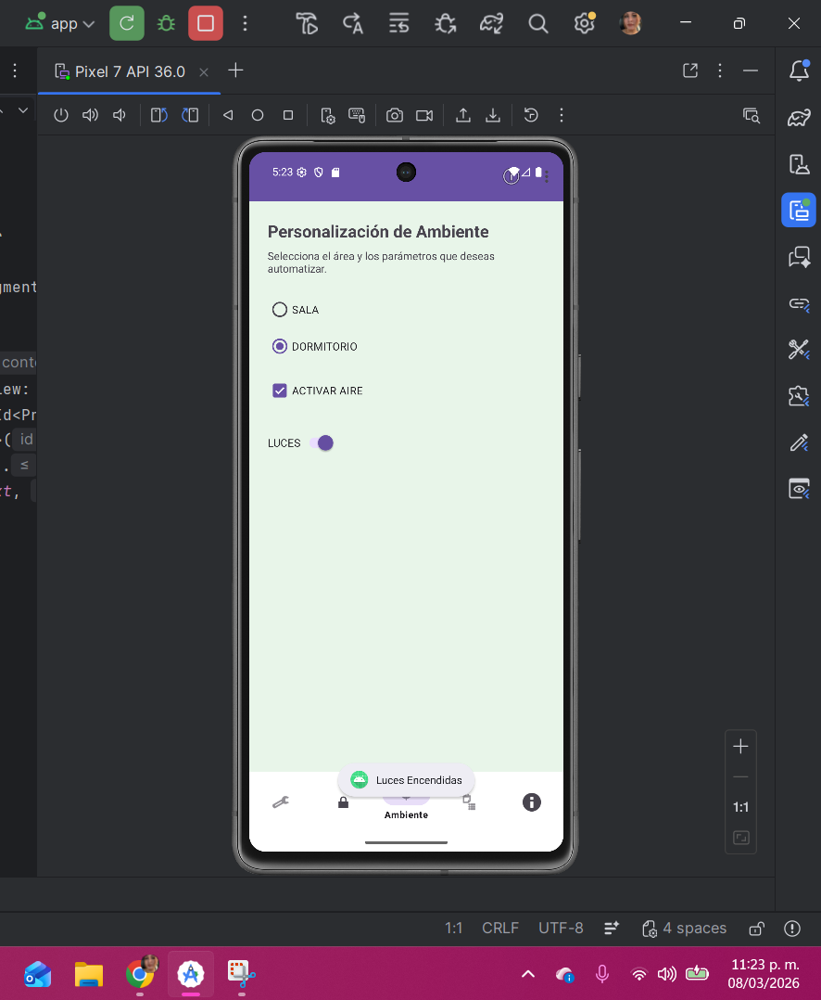
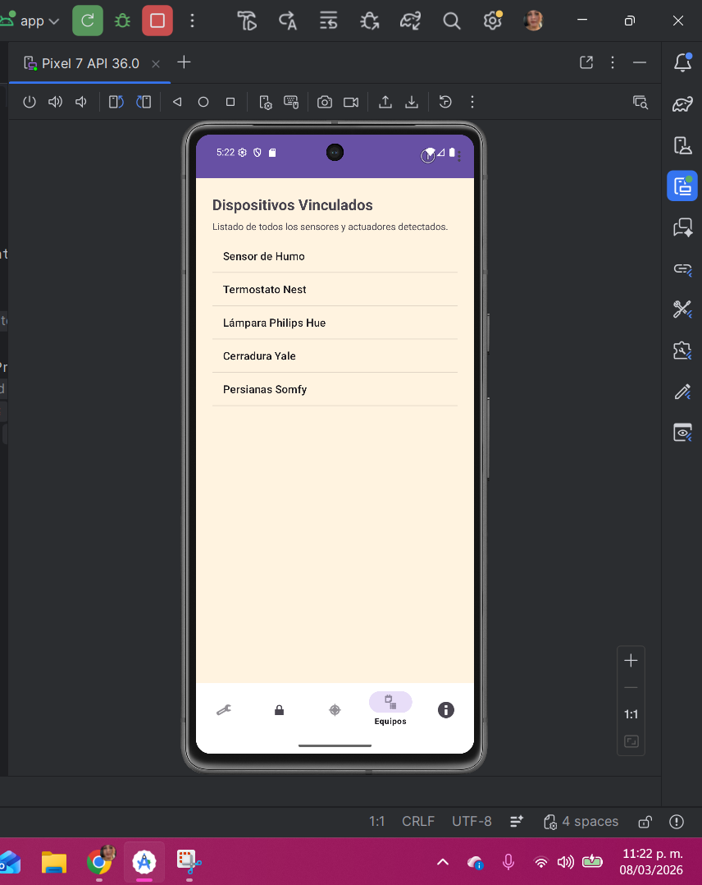
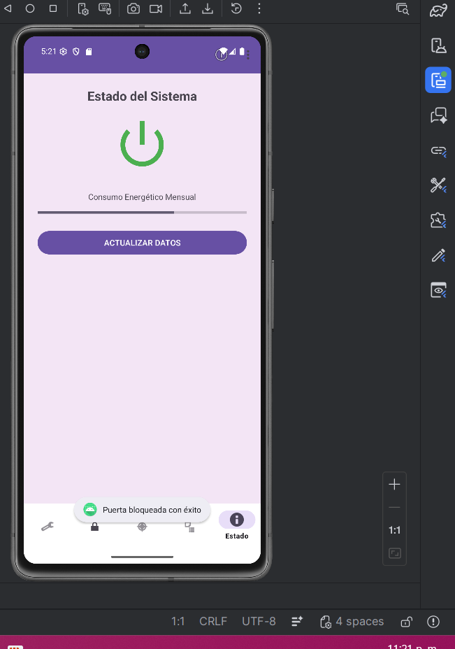

# Tarea 1

**SmartHome Connect** es una aplicación  desarrollada en Android Studio para demostrar el uso técnico de **Activities** y **Fragments**. La aplicación utiliza una temática de **Domótica (Casa Inteligente)** 

---

## Vista Previa de la App

| Configuración (TextFields) | Seguridad (Botones) | Ambiente (Selección) |
|:---:|:---:|:---:|
|  |  |  |

| Listas (Equipos) | Estado (Información) |
|:---:|:---:|
|  |  |

##Instrucciones de Uso

1. **Navegación:** Utiliza la barra inferior (**Bottom Navigation**) para moverte entre las 5 secciones.
2. **Configuración:** En la sección "Red", ingresa el nombre del Hub y contraseña para simular una vinculación.
3. **Control:** En la sección "Puertas", utiliza los botones para activar cerraduras o cámaras.
4. **Ambiente:** Selecciona una habitación y utiliza el interruptor para encender las luces inteligentes.
5. **Equipos:** Revisa la lista desplegable para ver los sensores conectados.
6. **Estado:** Observa la barra de progreso para monitorear el consumo de energía en tiempo real.

---

## Descripción de los Fragments

### 1. Configuración de Red (TextFields)
* **Elemento:** `EditText`.
* **Uso:** Captura de datos alfanuméricos como nombres de red y contraseñas.
* **Interacción:** Al presionar "Vincular", la app captura el texto y muestra un mensaje de confirmación (Toast).

### 2. Accesos y Seguridad (Botones)
* **Elementos:** `Button` e `ImageButton`.
* **Uso:** Ejecución de comandos directos mediante clics.
* **Interacción:** Permite bloquear puertas y abrir el visor de cámaras de seguridad.

### 3. Personalización de Ambiente (Selección)
* **Elementos:** `CheckBox`, `RadioButton` y `Switch`.
* **Uso:** Selección de opciones múltiples, opciones únicas y estados binarios (On/Off).
* **Interacción:** Control de luces y aire acondicionado según la habitación seleccionada.

### 4. Dispositivos Vinculados (Listas)
* **Elemento:** `ListView`.
* **Uso:** Visualización organizada de grandes conjuntos de datos.
* **Interacción:** Muestra el inventario actual de sensores detectados en la casa inteligente.

### 5. Estado del Sistema (Información)
* **Elementos:** `TextView`, `ImageView` y `ProgressBar`.
* **Uso:** Despliegue de información visual y estados de carga al usuario.
* **Interacción:** La barra de progreso muestra dinámicamente el consumo energético actual.

---

## Detalles Técnicos
* **Lenguaje:** Kotlin
* **Arquitectura:** Single Activity con navegación mediante Fragments.
* **Diseño:** Material Design.
* **Idioma:** Español.
